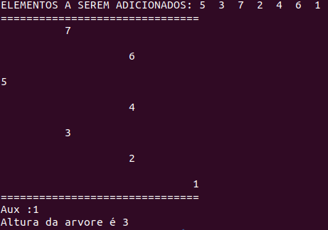

# Altura da Árvore
Sávio Rodrigues
---
# Introdução
O repositório referente à atividade avaliativa da matéria de Algoritmo e Estrutura de Dados II, tem como objetivo apresentar um método que consiga descobrir a altura de Árvores binária e AVL. A fim de cumprir com o objetivo do trabalho, foi utilizado apenas o código de árvore binária feito em sala de aula para os testes, e nele acrescentado um metodo *print2d()* para mais fácil vizualição da árvore. Em acréscimo, o método foi implementado em uma biblioteca cuja finalidade foi a de manter o documento organizado. 

# Código
## DescobrirAlturaDaArvore()
O método *DescobrirAlturaDaArvore()* (void) é da principal função a biblioteca *Altura.h*. Como parâmetro ela recebe a árvore e chama duas outras funções auxiliares *int \*getMaisBaixo()* e *getAltura()*. Por fim ela imprime o valor da altura da Árvore.
```C
void DescobrirAlturaDaArvore(Tree **t){
	//Ponteiros
	int maisbaixo = 0;
	int *maisBaixo = &maisbaixo;

	int auxi = 0;
	int *aux = &auxi;

	getMaisBaixo(t, maisBaixo, aux);
	//printf("Aux :%d\n", *aux);
	getAltura(t, aux);

    // Impressão
	printf("Altura da arvore é %d\n", i);
}
```
## getMaisBaixo()
O método *\*getMaisBaixo()* (int) é a função cuja finalidade é identificar o dado com valor localizado na parte mais profunda da árvore de forma recursiva. Recebe como parâmetro a árvore principal e dois ponteiros.
```C
int *getMaisBaixo(Tree **t, int *maisbaixo, int *aux){
	//printf("%d Aux: %d\n", (*t)->reg.key, *aux);
	if((*t)->dir!= NULL && (*t)->esq != NULL){
		if(*getMaisBaixo(&(*t)->dir, maisbaixo, aux) > *getMaisBaixo(&(*t)->esq, maisbaixo, aux)){
			*getMaisBaixo(&(*t)->dir, maisbaixo, aux);
		}else{
			*getMaisBaixo(&(*t)->esq, maisbaixo, aux);
		}

	}

	if((*t)->dir && (*t)->esq == NULL){
		*maisbaixo = *getMaisBaixo(&(*t)->dir, maisbaixo, aux);
		*aux = (*t)->dir->reg.key;

	}
	if((*t)->esq && (*t)->dir == NULL){
		*maisbaixo = *getMaisBaixo(&(*t)->esq, maisbaixo, aux);
		*aux = (*t)->esq->reg.key;

	}
	return maisbaixo;
}
```
## getAltura()
O método *getAltura()* (void) é a função que atua semelhante ao método *pesquisa()* onde, dado um valor, ele é capaz de identificar de forma recursiva onde está o dado. A função modifica a variável global i, indicando portanto, a altura na árvore. 
```C
void getAltura(Tree **t, int *aux){
	if(*aux > (*t)->reg.key){
		getAltura(&(*t)->dir, aux); 
		i++;
		return;
	}
	if(*aux < (*t)->reg.key){
		getAltura(&(*t)->esq, aux);
		i++;
		return;
	}
};
```

# Compilação
<p align="center">
    
</p>
A compilação printa a árvore e seus dados, imprime o valor de Aux responsável por guardar o dado mais profundo na árvore e por fim o cálculo da altura com o método *getAltura()*.
